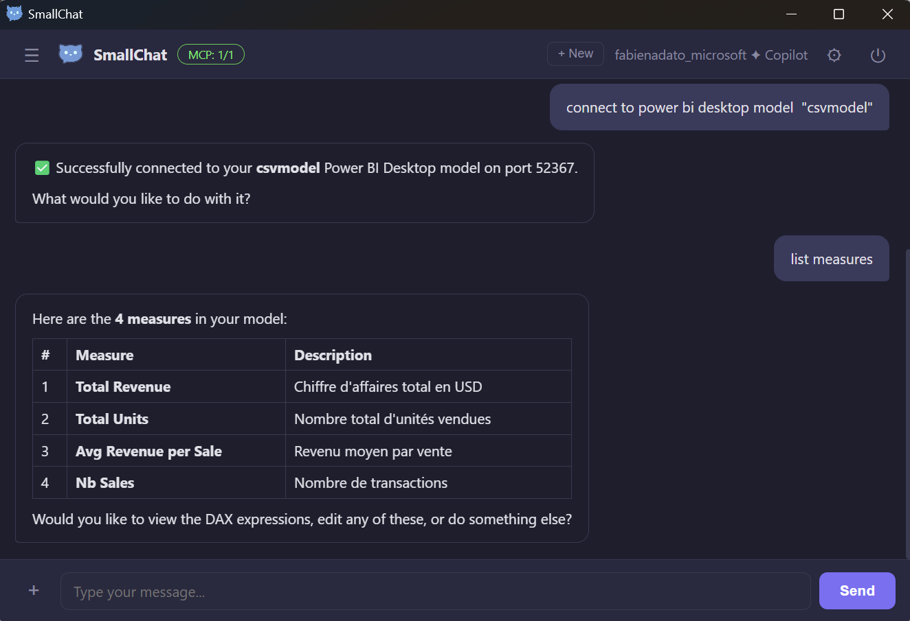
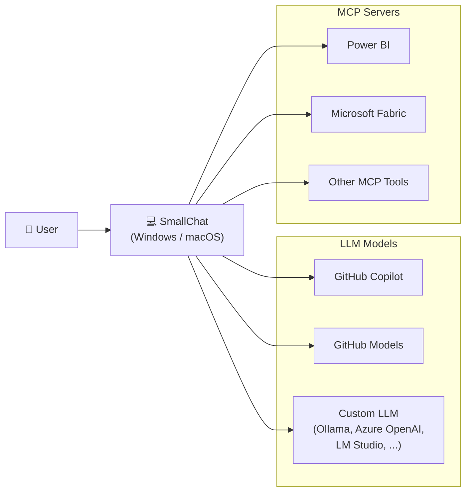

<p align="center">
  
</p>

<h1 align="center">SmallChat</h1>

A lightweight desktop chat application for GitHub Copilot or custom models with MCP (Model Context Protocol) server support. One chat window to talk to AI and interact with Power BI, Microsoft Fabric, and more... right from your desktop!

  

<p align="center">
  
</p>

## Architecture



## Features

- **GitHub Copilot API support** — Uses your Copilot license via OAuth device flow (same as VS Code) with streaming responses
- **Dynamic model list** — Fetches available models directly from the Copilot API for your account
- **Reasoning model support** — Full support for thinking/reasoning models (Claude Opus, o3, etc.) with collapsible reasoning blocks
- **Markdown rendering** — Assistant responses are rendered with full markdown (code blocks, tables, lists, etc.)
- **GitHub Models fallback** — Also supports the free-tier GitHub Models API (GPT-4.1, Grok 3, DeepSeek R1, Llama 4, etc.)
- **Image attachments** — Attach, paste, or drag-and-drop images into the chat; images are automatically resized and compressed to stay within API limits
- **File attachments** — Attach code and text files to your prompts; their contents are injected as context
- **Built-in filesystem tools** — The LLM can read, write, list, and create files/directories on your computer directly via tool calls
- **MCP server support** — Connect to any MCP-compatible server (stdio and HTTP/SSE transports) and use their tools directly in chat
- **Azure MCP authentication** — Automatic Azure device-code flow for MCP servers targeting Azure APIs (Fabric, Power BI, Azure Management, Microsoft Graph)
- **Tool-call loop** — The LLM can invoke tools and reason over the results automatically
- **Chat history** — Conversations are persisted locally with rename, delete, and sidebar navigation
- **Custom LLM support** — Connect to any OpenAI-compatible API (Ollama, LM Studio, Azure OpenAI, vLLM, etc.) with optional API key or Entra ID authentication
- **Azure OpenAI with Entra ID** — Device-code login with Microsoft Entra ID for Azure OpenAI endpoints — no API keys needed
- **Configurable** — Switch API mode, models, MCP config from the settings panel, or point to any OpenAI-compatible backend
- **Cross-platform** — Runs on Windows and macOS
- **Secure** — OAuth tokens stored encrypted locally; context isolation enabled; strict CSP

## Prerequisites

- [Node.js](https://nodejs.org/) 18+
- A **GitHub Copilot license** (recommended) — unlocks the Copilot API with higher rate limits and the full model catalog
- A **GitHub Personal Access Token** (optional) — only needed for the GitHub Models free tier fallback
- **None** — for custom LLM mode with local models (Ollama, LM Studio) or Entra ID auth

## Authentication

### GitHub Copilot (recommended)

1. Launch SmallChat and click **"Sign in with GitHub"**
2. A one-time code appears on screen and your browser opens to `github.com/login/device`
3. Paste the code on GitHub, click **Authorize**
4. SmallChat detects your Copilot license automatically — you'll see **⚝ Copilot** next to your username

This uses the GitHub OAuth Device Flow (same as VS Code). No token to manage or rotate.

### Personal Access Token (fallback)

For GitHub Models free tier only:

1. Go to **[github.com/settings/tokens](https://github.com/settings/tokens)**
2. Click **"Generate new token"** → **"Generate new token (classic)"**
3. Give it a name (e.g. `SmallChat`)
4. Select scopes: **`read:user`** and **`models:read`**
5. Click **"Generate token"** and copy it
6. In SmallChat, expand *"Use a Personal Access Token instead"* and paste it

### Custom LLM (Ollama, Azure OpenAI, etc.)

1. On the login screen, click **"Use with a custom LLM instead"** (or sign in with GitHub first and switch later in Settings)
2. In **Settings**, set API Mode to **Custom (OpenAI-compatible)**
3. Choose an authentication method:
   - **API Key** — Enter your key (or leave empty for local models like Ollama)
   - **Entra ID (Azure)** — Enter your tenant ID (optional), then sign in via device code on first chat
4. Set the **Model** name (e.g. `llama3`, `gpt-4o`, `mistral`)
5. Set the **Endpoint** URL:
   - Ollama: `http://localhost:11434/v1/chat/completions`
   - LM Studio: `http://localhost:1234/v1/chat/completions`
   - Azure OpenAI: `https://<resource>.openai.azure.com/openai/deployments/<deployment>/chat/completions?api-version=2024-10-21`

For **Entra ID**, SmallChat acquires a token with scope `https://cognitiveservices.azure.com/.default` via device code flow. The token is cached and refreshed automatically.

## Quick Start
### Option 1: Run the portable EXE

Download the latest `SmallChat-x.x.x-arm64-Setup.exe` or `SmallChat-x.x.x-x64-Setup.exe` from the `setup/` folder and run it directly — no installation or Node.js required.

### Option 2: Run from source
```bash
# Install dependencies
npm install

# Run the app
npm start
```

On first launch, click **“Sign in with GitHub”** and follow the device flow to authorize with your Copilot license.

## MCP Server Configuration

MCP servers are configured in the **Settings** panel (⚙ icon). The config follows the same format as `mcp-servers.json`:

### Stdio transport

```json
{
  "mcpServers": {
    "powerbi-model": {
      "type": "stdio",
      "command": "C:/MCPServers/powerbi-modeling-mcp.exe",
      "args": ["--start"],
      "env": {}
    }
  }
}
```

### HTTP/SSE transport (with Azure auto-auth)

```json
{
  "mcpServers": {
    "fabric": {
      "type": "http",
      "url": "https://api.fabric.microsoft.com/...",
      "headers": {}
    }
  }
}
```

For Azure-hosted MCP servers (Fabric, Power BI, Azure Management, Microsoft Graph), SmallChat automatically acquires a Bearer token via Azure device-code flow — no manual token setup needed.

Each entry supports:

| Field | Description |
|-------|-------------|
| `type` | `"stdio"` (default) or `"http"` / `"sse"` |
| `command` | (stdio) The executable to launch |
| `args` | (stdio) Command-line arguments |
| `url` | (http/sse) The server URL |
| `headers` | (http/sse) Custom headers |
| `env` | Additional environment variables (stdio only) |

Click the **MCP** badge in the header to see connected servers and their tools. Use **Reconnect All** after editing the config.

## Built-in Filesystem Tools

The LLM has 4 built-in tools for working with files directly, without needing an external MCP server:

| Tool | Description |
|------|-------------|
| `fs_read_file` | Read the contents of a file |
| `fs_write_file` | Write/create a file (auto-creates parent directories) |
| `fs_list_directory` | List files and subdirectories |
| `fs_create_directory` | Create a directory tree |

These tools are always available. Just ask the LLM to create, read, or modify files and it will use them automatically.

## Settings

Click the ⚙ icon in the header to change:

- **API Mode** — Switch between **GitHub Copilot** (uses your license, recommended), **GitHub Models** (free tier with lower rate limits), and **Custom (OpenAI-compatible)** for local or cloud LLMs
- **Model** — In Copilot mode, models are fetched dynamically from the API based on your license. In Models mode, choose from GPT-4.1, Grok 3, DeepSeek R1, Llama 4, Phi-4 and more. In Custom mode, type any model name.
- **Authentication** — In Custom mode, choose between API Key or Entra ID (Azure). Entra ID uses device-code flow with an optional tenant ID.
- **API Endpoint** — Auto-configured per mode. Change this to use Azure OpenAI or any OpenAI-compatible endpoint.

## Reasoning Models

When using thinking/reasoning models (e.g. Claude Opus, o3), SmallChat shows:
- A collapsible **“Reasoning”** block with the model’s chain-of-thought
- The final answer rendered in full markdown below it

## Project Structure

```
SmallChat/
├── main.js              # Electron main process, IPC handlers, built-in filesystem tools & image compression
├── preload.js           # Secure IPC bridge (context isolation)
├── package.json         # Dependencies & build config
├── mcp-servers.json     # Default MCP server configuration (migrated to settings on first run)
├── assets/
│   ├── icon.png         # Application logo (1024x1024)
│   └── icon.ico         # Windows icon (multi-size: 16–256px)
├── src/
│   ├── auth.js          # GitHub OAuth device flow, Copilot token exchange & encrypted storage
│   ├── copilot.js       # Tri-mode API client with SSE streaming (Copilot / GitHub Models / Custom + Entra ID)
│   └── mcp-manager.js   # MCP client manager (stdio + HTTP/SSE transports, Azure device-code auth)
└── renderer/
    ├── index.html       # Chat window UI
    ├── styles.css       # Dark theme styling
    ├── app.js           # Frontend logic (chat, history, attachments, paste/drag-drop)
    └── marked.umd.js    # Markdown rendering library
```

## Building for Distribution

```bash
# Windows (builds for the current architecture)
npm run build:win

# Windows ARM64 specifically
npx electron-builder --win --arm64

# Windows x64 specifically
npx electron-builder --win --x64

# macOS dmg
npm run build:mac
```

Output files are placed in `dist/` with architecture in the filename (e.g. `SmallChat-1.0.0-arm64.exe`, `SmallChat-1.0.0-x64.exe`).

## License

MIT
